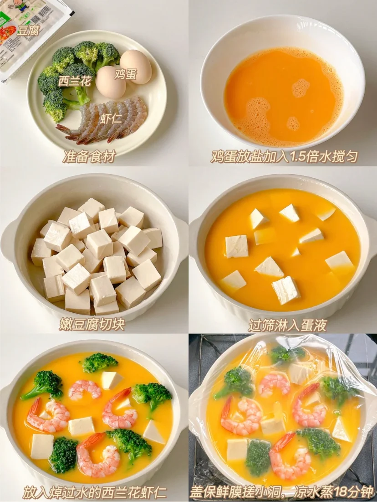
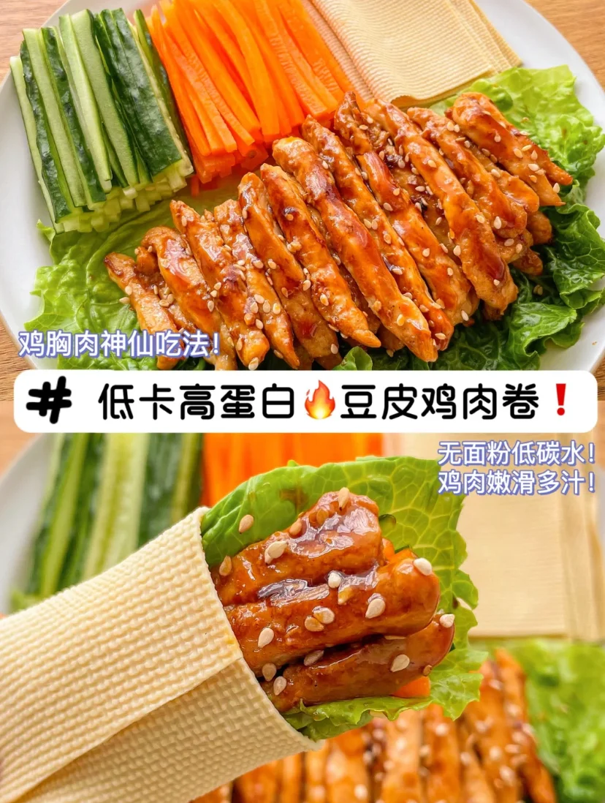
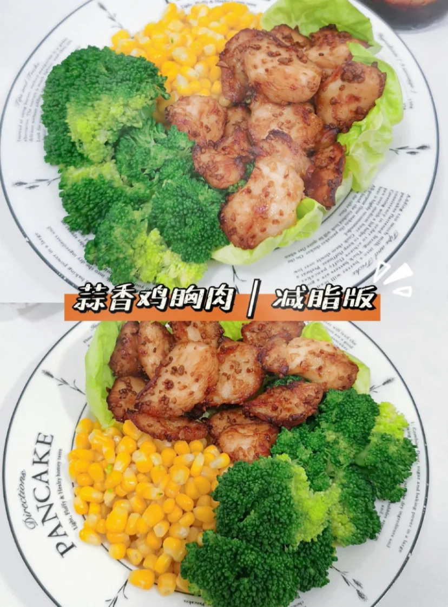
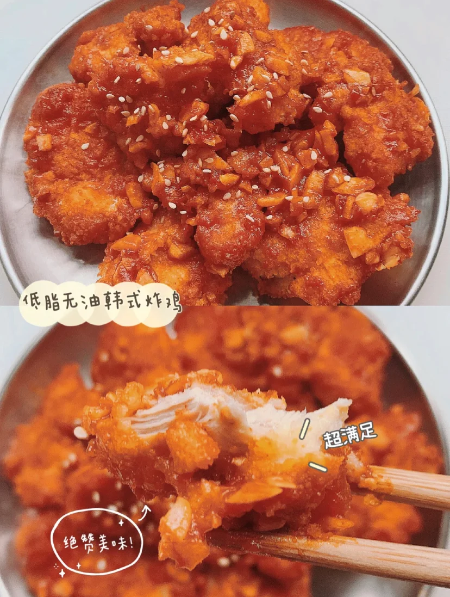
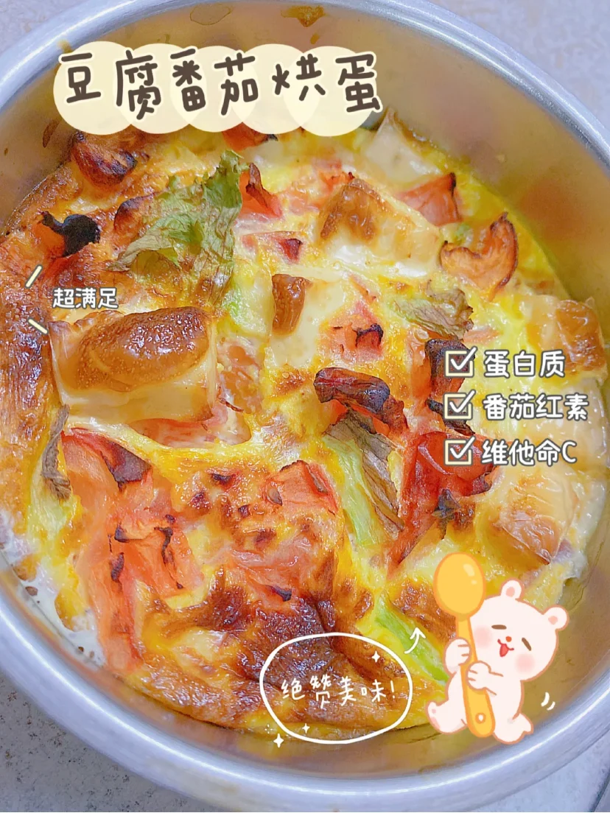

1. 食材选择

* 鸡蛋
* 虾仁
* 西兰花
* 豆腐
* 牛排
* 青菜
* 小白菜
* 菠菜
* 玉米
* 胡萝卜
* 牛奶
* 黄瓜
* 鸡胸肉
* 冬瓜
* 山药
* 荷兰豆

宜少量
* 土豆
 
# 菜谱

## 主食

* 蒸玉米
* 蒸紫薯
* 蒸南瓜
* 粗粮米饭
* 杂粮饭

## 炒菜

* 炒青菜
* 炒白菜
* 炒菠菜
* 白灼虾仁
* 炒包菜
* 炒花菜
* 清蒸鲈鱼
* 麻婆豆腐
* 牛排
* 虾仁粉丝

### 美食菜谱

#### 虾仁豆腐蒸蛋

#### 豆皮鸡胸肉卷

**准备食材**: 鸡胸肉、青瓜、胡萝卜、生菜、豆皮
**做法**:
1、鸡胸肉加入姜丝，1勺料酒+1勺酱油+半勺淀粉+黑胡椒粉抓匀腌制30分钟
2、豆皮切小块，水煮好后备用
3、少油热锅加入鸡胸肉煎香，加半勺蚝油，少量老抽，翻炒均匀
4、豆皮上放入一片生菜，再放入鸡胸肉、胡萝卜、青瓜，卷起来后就能开餐了！

#### 蒜香鸡胸肉

**准备材料**：西兰花、玉米粒、蒜末、蚝油、麻油、黑胡椒
**做法**：
1、将西兰花和玉米粒都倒进煮沸的水煮一下
2、鸡胸肉切块再加入蒜末、麻油、耗油、生抽少许盐和黑胡椒，腌制10分钟以上让它入味
3、最后放入气炸锅调节180度烤20分钟，美味又的蒜香鸡胸肉就完成啦

#### 低卡韩式炸鸡

**准备材料**：鸡胸肉/鸡腿肉、、面包糠适量、鸡蛋1个、牛奶1盒
**酱料**：1勺蒜末、1勺韩式辣酱、1勺番茄酱、5勺清水
**做法**:
1、将鸡腿肉或者鸡胸肉去皮去骨，然后切成小块，倒入淹没鸡肉的牛奶加盐和黑胡椒腌制半小时以上
2、腌好的鸡块先裹一层鸡蛋液，再裹一层面包糠，然后继续裹鸡蛋液再裹一层面包糠，一共重复两次
3、提前预热气炸锅，然后调节180度烤25分钟
4、将准备好的酱料，倒入平底锅，加热至冒泡就可以倒入烤好的鸡块了，均匀裹上酱料撒上芝麻完成！

#### 豆腐番茄烘蛋

**准备材料**：鸡蛋1粒、番茄 1粒、嫩豆腐 半盒
**做法**：
1、先将嫩豆腐切块然后铺在底层
2、番茄画好十字汆烫后去皮，然后切块铺在豆腐上
3、将鸡蛋打散后放适量盐、胡椒粉等调味料，倒入豆腐和番茄中
4、气炸锅200度预热5分钟，放入气炸锅200度烘烤20分钟就完成啦！

# 汤

* 冬瓜豆腐汤
* 西红柿鸡蛋汤
* 南瓜卧蛋汤
* 海带豆腐汤
* 山药南瓜萝卜汤